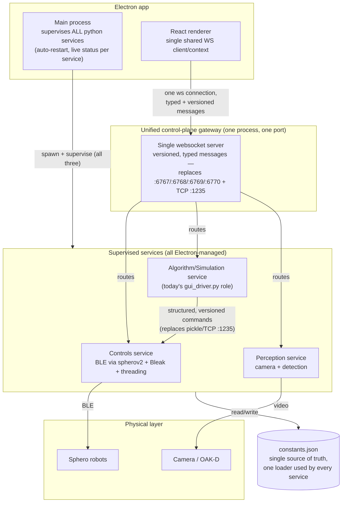

# Sphero Swarm — service architecture

Two diagrams: what's actually running today (warts included), and a proposed
cleaner version. Ports and process relationships below are verified against
current source (`gui/electron/main.ts`, `perception/server.py`,
`controls/Controls_Server.py`, `gui_server.py`, the GUI component websocket
URLs) as of this writing — re-verify before trusting if it's been a while.

## Current architecture (as-is)

```mermaid
flowchart TB
    subgraph Electron["Electron app (gui/electron/main.ts)"]
        Main["Main process\n(spawn + ipcMain handlers)"]
        Renderer["React renderer\n(App.tsx + components,\neach opens its own websocket)"]
    end

    subgraph Managed["Spawned & supervised by Electron"]
        GuiPy["gui/link/gui.py\none-shot: prints constants.json, exits"]
        Spotter["perception/sphero_spotter.py\nlong-running"]
        ControlsServer["controls/Controls_Server.py\nlong-running BLE control server"]
    end

    subgraph Unmanaged["NOT spawned by Electron — run manually in a terminal"]
        GuiDriver["gui_driver.py\nalgorithm/simulation driver"]
        GuiServer["gui_server.py\nimported by gui_driver.py"]
    end

    subgraph Hardware["Physical layer"]
        Spheros["Sphero robots\n(BLE via spherov2 + Bleak)"]
        Camera["Camera / OAK-D"]
    end

    ConstantsFile[("constants.json")]

    Main -- "spawn (start/stop IPC)" --> GuiPy
    Main -- "spawn (start/stop-sphero-spotter)" --> Spotter
    Main -- "spawn (start/stop-controls)" --> ControlsServer
    GuiPy -- "stdout JSON" --> Main
    Main -- "get-constants (IPC)" --> Renderer
    Renderer -- "save-constants (IPC)" --> ConstantsFile

    Renderer -- "ws :6768 — connect/disconnect/rehome" --> ControlsServer
    Renderer -- "ws :6769 — dashboard + Simulation tab" --> GuiServer
    Renderer -- "ws :6767 — video frames" --> Spotter
    Renderer -- "ws :6770 — telemetry" --> Spotter

    ControlsServer -- "BLE (threading, one thread/ball)" --> Spheros
    Spotter -- "video feed" --> Camera

    GuiDriver -- imports --> GuiServer
    GuiDriver -- "TCP :1235 — pickled Instruction lists\n(only when 'Use Controls' is on)" --> ControlsServer
    GuiDriver -- reads --> ConstantsFile
    ControlsServer -- reads --> ConstantsFile
    GuiPy -- reads --> ConstantsFile

    style Unmanaged fill:#3a1f1f,stroke:#c0392b,stroke-width:2px
```

### What's actually bad about this

- **`gui_driver.py`/`gui_server.py` live completely outside Electron's
  process lifecycle.** No auto-start, no auto-restart on crash, no signal in
  the GUI that they're even supposed to be running. Forget to launch them and
  the Simulation tab just shows "Reconnecting…" forever with no explanation.
- **Five independent, uncoordinated network endpoints** — raw pickle TCP on
  `1235`, and websockets on `6767`/`6768`/`6769`/`6770` — with no shared
  registry, no auth (fine for localhost-only, but nothing stops a second
  `Controls_Server` instance silently binding the same port), and no
  version/schema negotiation on any of the wire formats.
- **`pickle` over a raw socket is a latent code-execution risk** if port 1235
  were ever reachable beyond localhost — deserializing untrusted pickle data
  runs arbitrary code by design.
- **Every component opens its own websocket connection** rather than sharing
  one through context — `Controls.tsx` alone opens both `:6768` and `:6769`
  itself; `App.tsx` separately opens `:6769` again. Redundant connections,
  each with its own independent reconnect timer.
- **No protocol versioning.** Adding a new `Instruction.type` or a new
  websocket message shape breaks silently until both ends are redeployed in
  lockstep.
- **Two disconnected "sources of truth" for what's running**: Electron's
  IPC-managed process table, and whatever the developer remembers is still
  open in a terminal.

## Proposed architecture

### Why this is better

- **One supervised process table.** The algorithm/simulation driver becomes a
  real Electron-managed service like the other two — status visible in the
  GUI, restarts on crash, no "did I remember to start this in a terminal"
  failure mode.
- **One connection per renderer, one gateway process.** Components subscribe
  to message *types* through shared context instead of each opening its own
  socket to its own port. Fewer sockets, one reconnect policy, one place to
  add auth if this ever needs to run on more than localhost.
- **Structured, versioned messages replace raw pickle.** Kills the
  deserialize-arbitrary-code risk and makes it possible to add a new command
  type without silently breaking whichever end hasn't been redeployed yet.
- **Same physical-layer boundaries, less accidental coupling.** Controls
  still owns BLE, perception still owns the camera — the gateway is a
  routing layer, not a rewrite of the domain logic in either service.

This is a direction, not a mandate — it's a real refactor (new gateway
process, message schema, Electron process-supervision changes) worth an RFC
of its own via the `controls-rfc` skill before touching anything, not a
same-day change.
