# Distributed Sphero control — plan vs. current code

Verification of the "Pi owns Bluetooth / mini-PC coordinates" plan against
what's actually in this repo today. Every claim below is grounded in a
specific file:line — re-verify if it's been a while since this was written.

## The one thing that blocks everything

Every network endpoint in this codebase binds to `'localhost'` only:

| Endpoint | File:line | Binds to |
|---|---|---|
| `Instruction` protocol (TCP 1235) | `controls/Controls_Server.py:190` | `'localhost'` |
| Control-plane websocket (6768) | `controls/Controls_Server.py:573` | `"localhost"` |
| Simulation websocket (6769) | `gui_server.py:124` | `"localhost"` |
| Frame/telemetry websockets (6767/6770) | `perception/server.py:18,20` | `"localhost"` |

Every client matches: `gui_driver.py:180` connects to `("localhost", port)`;
every GUI component opens `ws://localhost:PORT`. None of this is reachable
from another machine today. Electron's `main.ts` also only knows how to
`spawn()` local child processes — no remote-start concept exists.

**This has to change before any part of the distributed plan works**,
independent of which other design decisions get made.

## Requirement-by-requirement verdict

| Plan section | Requirement | Status |
|---|---|---|
| §2 | Pi owns BLE, one process per Pi | **Compatible in spirit, not yet built.** `Controls_Server.py`'s connect/threading core needs no change — but it currently manages *all* configured balls in one process from one global `constants.json`. Running one instance per Pi needs a per-Pi ball-subset config, which doesn't exist. |
| §2 | Mini-PC coordinates, doesn't touch BLE directly | **Already the shape of the existing split** — `gui_driver.py` (computes) talks to `Controls_Server.py` (executes BLE) over the port-1235 socket. Both currently run on the same machine over loopback; see blocker above. |
| §8 | New HTTP/JSON REST API | **Doesn't exist.** Current protocol is a websocket JSON control-plane (connect/disconnect/rehome) plus pickled `Instruction` lists over raw TCP. Real decision, not a gap: build the HTTP API as specified, or keep the existing protocol as the Pi↔mini-PC wire format. The second option is less new code but means pickle deserialization now crosses a real machine boundary — a code-execution risk if that port is ever reachable beyond a fully trusted LAN. Their own §19 security section doesn't address this. |
| §9.1 | Command timeout / auto-stop | **Already implemented.** Every roll/turn/wait `Instruction` is duration-bounded, polls `KILL_FLAG`, and self-stops via `stop_roll()`. No change needed. |
| §9.2 | Watchdog / heartbeat | **Functionally already implemented, different mechanism.** `command_gathering()`'s `except EOFError` fires on client disconnect and injects a kill instruction for every ball — a TCP-drop-triggered watchdog rather than an explicit heartbeat message. Sufficient as-is per Pi. |
| §9.3 | Emergency stop | **Partially exists.** `disconnect_all` tears down every connection (full reconnect required afterward) — not the lighter "halt motion, stay connected" the plan implies. Worth deciding which one you actually want per Pi before building it. |
| §9.4 | Auto-reconnect with backoff | **Doesn't exist.** `find_balls`/`connect_ball` retry a fixed count *at startup only*. Detecting a mid-session BLE drop and reconnecting with increasing delay is new work. |
| §9.5/9.6 | Safe startup / shutdown | **Already correct.** Connecting never moves anything; `run_server()`'s `try/finally` guarantees teardown; any in-flight command's own trailing `stop_roll()` halts motion before disconnect. |
| §12 | Identify exact Sphero model | **Likely already answered.** `SB-` tag naming and `bolt.set_speed()`/`bolt.set_heading()` conventions throughout the demo code point to Sphero BOLT already being the target — write it down rather than treating it as open. |
| §20 | Systemd autostart on Pi boot | **Doesn't exist.** `Controls_Server.py` only starts because Electron's `spawn()` chose to launch it. A Pi running headless after reboot, independent of any mini-PC/GUI being present, needs its own unit file and a decoupling from Electron's spawn model. |

## The admin dashboard question

**One already exists** — the Electron + React GUI (`gui/`). It already provides:

- Per-ball connection status and manual connect/disconnect/rehome (Controls tab)
- Live algorithm/simulation state (Simulation tab, via `gui_server.py`)
- Camera stream (Perception tab)
- Constants editing (Config tab)

What it cannot do yet: know about *multiple* Pis, maintain a robot↔Pi
registry, or start/stop a remote process — all downstream of the
`spawn()`-is-local constraint above.

The "proposed architecture" unified gateway sketched in
[`docs/architecture.html`](architecture.html) (written before this plan, for
a different problem — the five uncoordinated *local* endpoints) turns out to
be the right shape here too: one gateway process on the mini-PC aggregating
N Pi-side services behind a single websocket, which the existing GUI already
knows how to consume without a rewrite of its component logic.

## Target architecture — where things end up

The end state after the "fix localhost / decide the protocol / per-Pi
config" steps below are done. Two concrete calls are made here that the
verdict table above left open:

- **The API lives on each Pi, and it's HTTP/JSON — not the old
  pickle-over-TCP socket.** Pickle deserializing data that crosses a real
  machine boundary is a code-execution risk; JSON isn't. Each Pi's Controls
  Service exposes the §8-style endpoints (`/robots/:id/drive`, `/stop`,
  `/led`, `/health`) bound to its real LAN address.
- **The algorithm/simulation "brain" (today's unmanaged `gui_driver.py`)
  moves into the mini-PC's Coordinator process** — a supervised service, not
  a script someone remembers to launch in a terminal. It's the natural home:
  the Coordinator already holds the robot registry and is where perception
  feedback needs to land anyway.

```mermaid
flowchart TB
    subgraph MiniPC["Mini-PC"]
        GUI["Electron + React GUI<br/>admin dashboard - UI mostly unchanged"]
        Coordinator["Coordinator / Gateway service<br/>robot registry: robot_id -> Pi + MAC<br/>algorithm/simulation brain<br/>(absorbs today's gui_driver.py role)"]
        Perception["Perception service<br/>ball position tracking<br/>(stays centralized - one camera, one view of the whole play surface)"]
    end

    subgraph Pi1["Raspberry Pi #1"]
        API1["Controls Service<br/>HTTP/JSON API - OUR API LIVES HERE<br/>bound to LAN IP, not localhost<br/>systemd autostart on boot"]
        BLE1["spherov2 + Bleak + threading<br/>(unchanged BLE/connect core)"]
    end

    subgraph Pi2["Raspberry Pi #2"]
        API2["Controls Service<br/>HTTP/JSON API<br/>systemd autostart"]
        BLE2["spherov2 + Bleak + threading"]
    end

    Camera["Overhead camera"]
    SpherosA["Sphero A, B<br/>assigned to Pi #1"]
    SpherosB["Sphero C, D<br/>assigned to Pi #2"]

    GUI -- "local websocket, JSON<br/>same shape as today's :6768/:6769" --> Coordinator
    Coordinator -- "HTTP/JSON<br/>POST /robots/:id/drive .../stop .../led<br/>GET /robots .../health" --> API1
    Coordinator -- "HTTP/JSON" --> API2
    Camera -- video --> Perception
    Perception -- "ball positions" --> Coordinator

    API1 --> BLE1
    API2 --> BLE2
    BLE1 -- BLE --> SpherosA
    BLE2 -- BLE --> SpherosB

    style API1 fill:#173a1c,stroke:#5ac95a,stroke-width:2px
    style API2 fill:#173a1c,stroke:#5ac95a,stroke-width:2px
```

Everything downstream of "Controls Service" on each Pi — the threading
model, spherov2/Bleak connection handling, duration-bounded auto-stop, the
disconnect watchdog — is the part of `Controls_Server.py` that already works
and doesn't move. What changes is what wraps it: an HTTP layer facing the
network instead of a loopback-only websocket + pickle socket, and a per-Pi
robot subset instead of one global list.

## Recommended order, reconciled with what's already built

1. Fix the `'localhost'` bindings and hardcoded client targets — the
   mandatory first step, touches `Controls_Server.py`, `gui_server.py`,
   `perception/server.py`, `gui_driver.py`, and every GUI websocket URL.
2. Decide the HTTP-API-vs-existing-protocol question (§8) explicitly — don't
   let it default silently either way.
3. Build the per-Pi ball-roster config (their `robots.yaml` idea) — genuinely
   new, needed either way.
4. Add live reconnect-with-backoff (§9.4) and the systemd unit (§20) —
   genuinely new, needed either way.
5. Decide what "emergency stop" should actually do (§9.3) — halt motion vs.
   full disconnect — before building it, since `disconnect_all` already does
   the heavier version.
6. Only then extend the existing GUI into a multi-Pi-aware gateway consumer,
   per the unified-gateway sketch above.

Everything else in the plan — safety timeouts, safe start/shutdown, the
BLE/threading core, the model choice — is either already correct or already
decided; don't re-derive it.
